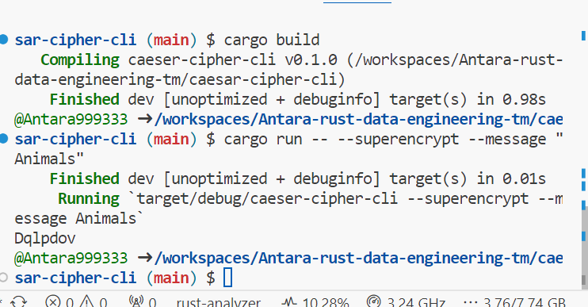

# Rust Data Engineering Project
# Caesar-Cipher_CLI
# Main.rs 
I altered the code in main.rs so that 'encrypt' was changed to 'superencrypt'. I also removed the 'short' option because it created a conflict between 'shift' and 'superencrypt'.

